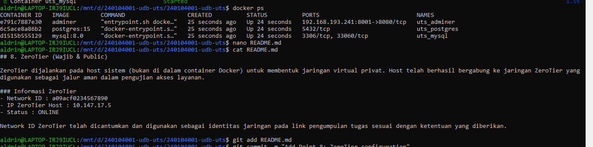
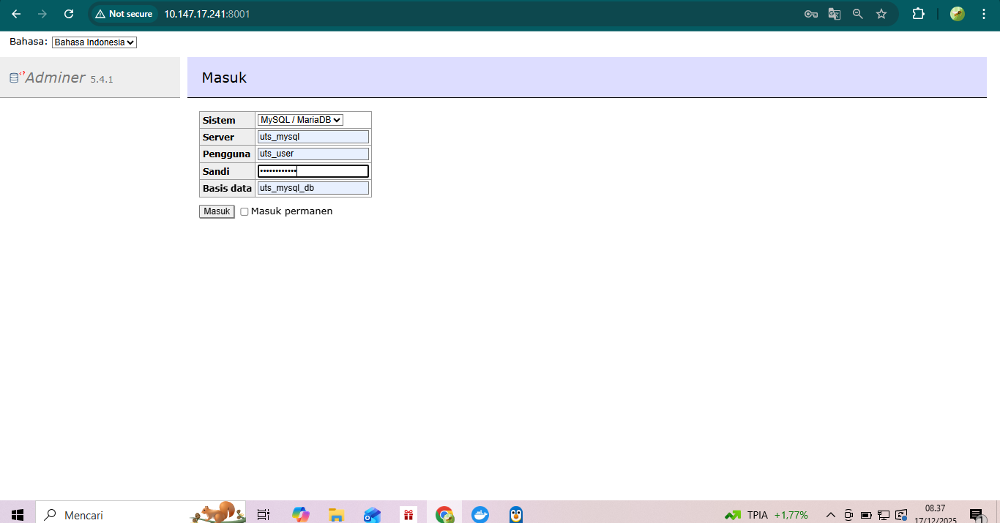
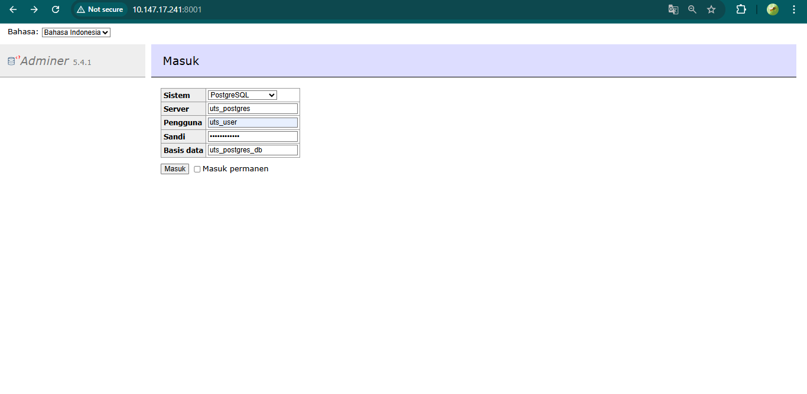

# UTS Docker Database

## Identitas Mahasiswa
- Nama : Aldrin Sandeanto
- NIM  : 240104001

## Port Adminer
- Port Adminer yang digunakan: 8001

## IP ZeroTier
- IP ZeroTier: 10.147.17.241

## Cara Menjalankan Project
1. Clone repository:
   ```bash git clone git@github.com:240104001-a11y/240104001-udb-uts.git```
##screenshots






